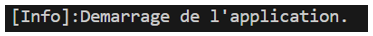

# Système de navigation par GPS

Nous souhaitons créer un système de navigation par GPS. Nous utilisons le langage C++, l'éditeur VSCode, l'outil CMake, la librairie Qt, le système de gestion Git, l'hébergeur GitHub, l'outil TortoiseGit.

# Création du projet C++

Nous utilisons l'éditeur VSCode pour créer un projet C++ avec l'outil CMake. Nous affichons un message simple à l'écran pour vérifier la création du projet.

### Gestion du programme principal

-   main.cpp
```cpp
#include <iostream>

int main(int argc, char **argv)
{
    std::cout << "[Info]:Demarrage de l'application.\n";
    return 0;
}
```
### Gestion des configurations

-   CMakeLists.txt
```cmake
cmake_minimum_required(VERSION 3.10.0)
project(ReadyGPS VERSION 0.1.0 LANGUAGES C CXX)

add_executable(${PROJECT_NAME}
    main.cpp
)
```

### Exécution du projet




# Initialisation du projet Qt

Nous modifions les sources du projet pour afficher une fenêtre basique avec la librairie Qt afin de vérifier sa prise en charge. Nous modifions le fichier de configuration de l'outil CMake afin de prendre en charge la librairie Qt. Nous modifions aussi le fichier de configuration de l'éditeur VSCode pour pointer les binaires de la librairie Qt afin de pourvoir exécuter le projet Qt à partir de l'éditeur VSCode.

### Gestion du programme principal

-   main.cpp
```cpp
#include <iostream>

int main(int argc, char **argv)
{
    std::cout << "[Info]:Demarrage de l'application.\n";
    return 0;
}
```

### Gestion des configurations

-   CMakeLists.txt
```cmake
cmake_minimum_required(VERSION 3.10.0)
project(ReadyGPS VERSION 0.1.0 LANGUAGES C CXX)

add_executable(${PROJECT_NAME}
    main.cpp
)
```

-   VSCode (settings.json)
```json
{
    "cmake.environment": {
        "PATH": "C:/tools/Qt/6.9.0/msvc2022_64/bin"
    },
}
```

### Exécution du projet


# Initialisation de la barre d'outils de la fenêtre principale

Nous utilisons la classe (QToolBar) pour initialiser la barre d'outils de la fenêtre principale (cMainWindow). Par défaut, la barre d'outils présente l'ensemble des outils de navigation dont a besoin un utilisateur final pour bénéficier de l'application. En mode designer, la barre d'outils ajoute l'ensemble des outils nécessaire à un administrateur pour configurer l'application avec la possibilité de créer un forfait téléphonique.

### Exécution du projet

-   La barre d'outils peut être affichée en mode standard (utilisateur), ce qui permet d'accéder à l'ensemble des outils nécessaire pour l'utilisateur final.


-   La barre d'outils peut être affichée en mode designer (administrateur), ce qui permet d'accéder aux outils d'exécution, de calculs de géométrie, de débogage, d'affichage des statistiques, de tests, de création de forfait téléphonique


# Contacts

-   [Site web (ReadyDev)](https://readydev.ovh/home)
-   [LinkedIn (Contactez-moi)](https://www.linkedin.com/in/tia-gerard-kesse/)
